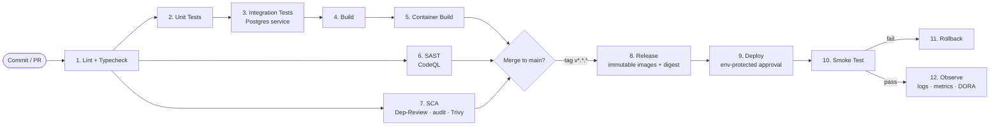

# Architecture

> Authoritative architecture document for **WanderSync** (real-time collaborative travel planning).
> Stack: **Next.js 14 (App Router) + Node.js/Express + Prisma + PostgreSQL + Socket.io**.
>
> This document covers (1) the actual codebase architecture, (2) deep-research reference
> architectures for **Node.js backends** and **React Native** apps. The frontend in this
> repo is **Next.js (web)** — React Native is documented as a reference for teams
> extending WanderSync to mobile.

---

## Table of Contents

1. [Repository Topology](#1-repository-topology)
2. [Backend — Node.js / Express / Prisma / Socket.io](#2-backend--nodejs--express--prisma--socketio)
3. [Frontend — Next.js (this repo)](#3-frontend--nextjs-this-repo)
4. [React Native — Reference Architecture (deep research)](#4-react-native--reference-architecture-deep-research)
5. [Cross-cutting Concerns](#5-cross-cutting-concerns)
6. [Real-time Event Map](#6-real-time-event-map)
7. [Deployment Topology](#7-deployment-topology)

---

## 1. Repository Topology

```
.
├── backend/                  # Node.js + Express + Prisma + Socket.io
│   ├── prisma/               # Schema, migrations, seed
│   └── src/
│       ├── lib/              # Singletons (prisma client)
│       ├── middleware/       # auth, errorHandler
│       ├── routes/           # auth, trips, itinerary, chat, voting, notifications
│       ├── services/         # Business logic (notifications, ...)
│       ├── socket/           # Socket.io server + handlers
│       └── index.ts          # App composition + bootstrap
├── frontend/                 # Next.js 14 App Router
│   └── src/
│       ├── app/              # Routes (App Router): /, /login, /dashboard, /trip/[id], /join/[code]
│       ├── components/       # Feature-scoped components (chat, itinerary, map, ui, voting)
│       ├── hooks/            # useSocket
│       ├── lib/              # api client, socket client, stores (zustand)
│       └── types/            # Shared TS interfaces
├── change_log/               # Per-feature summaries (≤300 words each). See AGENTS.md.
├── .github/workflows/        # CI/CD (backend, frontend, deploy)
├── docker-compose.yml        # postgres + backend + frontend (dev)
├── Architecture.md           # ← this file
└── AGENTS.md                 # Agent / contributor guide
```

---

## 2. Backend — Node.js / Express / Prisma / Socket.io

### 2.1 Layered Architecture

The backend follows a pragmatic **layered architecture** (sometimes called *clean-ish* or *hexagonal-lite*):

```
HTTP request ──► Express Router ──► Middleware (auth, validation)
                                       │
                                       ▼
                                   Route handler
                                       │
                                       ▼
                                  Service layer  ◄────► Prisma (Postgres)
                                       │
                                       ▼
                                  Socket.io broadcast
                                       │
                                       ▼
                                   JSON response
```

| Layer | Folder | Responsibility |
|---|---|---|
| **Bootstrap** | `src/index.ts` | App composition: CORS, JSON parsing, route mounting, socket init, error handler, port bind. |
| **Middleware** | `src/middleware/` | `auth.ts` verifies JWT and attaches `userId`/`userEmail` to the request. `errorHandler.ts` is the terminal Express error handler. |
| **Routes** | `src/routes/` | Thin HTTP adapters. Validate input with **Zod**, call Prisma/services, return JSON. One file per resource: `auth`, `trips`, `itinerary`, `chat`, `voting`, `notifications`. |
| **Services** | `src/services/` | Reusable business operations (e.g. `createNotification`). Grow this layer as logic complexity increases. |
| **Data access** | `src/lib/prisma.ts` | A **single, memoized PrismaClient** to avoid pool exhaustion on hot reload. |
| **Real-time** | `src/socket/index.ts` | Socket.io server with JWT auth middleware, room-based broadcasting (`trip:<id>`, `user:<id>`), and a presence map. |

### 2.2 Request Lifecycle (Example: `POST /api/trips`)

1. CORS + JSON middleware accept the request.
2. `authMiddleware` verifies the `Authorization: Bearer <jwt>` header.
3. The `trips` router parses the body with `TripSchema` (Zod).
4. Prisma creates a `Trip` and an `OWNER` `TripMember` in one call (relational nested write).
5. The created trip is returned (201). If anything throws, `errorHandler` converts it to a JSON 500.

### 2.3 Data Model (Prisma)

Models: `User`, `Trip`, `TripMember` (join, with `MemberRole` enum), `ItineraryItem`,
`Message`, `Suggestion`, `Vote`, `Notification` (with `NotificationType` enum). Cascade
delete is configured on cross-cutting children (members, itinerary items, messages, etc.)
so deleting a `Trip` cleans up its graph.

Highlights:
- UUID primary keys (`@default(uuid())`).
- `Trip.inviteCode` is a unique UUID used for the join-by-link flow.
- `Vote` has `@@unique([suggestionId, userId])` to enforce one vote per user per suggestion.

### 2.4 Real-time (Socket.io)

- **Auth**: socket-level middleware verifies the JWT from `socket.handshake.auth.token`
  and attaches the user.
- **Rooms**: each trip is a room (`trip:<tripId>`); each user has a personal room
  (`user:<userId>`) for direct notifications.
- **Presence**: an in-memory `Map<socketId, SocketUser>` powers `presence:online` /
  `presence:joined` / `presence:left`.
- **Authorization**: before joining `trip:<id>`, the server checks the user is a
  `TripMember`.
- **Events emitted**: `chat:message`, `chat:typing`, `itinerary:editing`,
  `notification:new`, plus the presence events above. (REST endpoints emit
  itinerary/voting events from their handlers.)

### 2.5 Configuration & Secrets

`backend/.env`:
- `DATABASE_URL` — Postgres connection string
- `JWT_SECRET` — 32+ random characters in production
- `PORT`, `FRONTEND_URL`, `NODE_ENV`

### 2.6 Node.js Backend — Reference Architecture (deep research)

A modern Node.js backend typically composes these layers:

| Concern | Common choices | What we use |
|---|---|---|
| HTTP framework | Express, Fastify, NestJS, Hono | **Express** (smallest learning curve, huge ecosystem) |
| Validation | Zod, Joi, class-validator | **Zod** (TS-first, infers types) |
| ORM / data access | Prisma, Drizzle, TypeORM, Knex | **Prisma** (type-safe, great DX, migrations) |
| Auth | JWT, sessions, OAuth, Passport | **JWT** (stateless, fits SPAs and sockets) |
| Real-time | Socket.io, native WS, SSE | **Socket.io** (rooms, fallbacks, reconnection) |
| Logging | pino, winston | *Recommended add: pino* |
| Process | pm2, Docker + orchestrator | **Docker** (compose for dev, image for prod) |
| Testing | Jest, Vitest + Supertest | **Jest + Supertest** (see `Architecture.md §5.5`) |

**Layering principles** (apply as the codebase grows):

1. **Routes are thin.** They translate HTTP ⇄ service calls; no business logic.
2. **Services own business rules.** Services accept and return plain objects, never `req`/`res`.
3. **Repositories (or a direct ORM) handle persistence.** Today this is Prisma calls inside services; extract a repository layer once you need to swap the data store or mock it heavily in tests.
4. **Cross-cutting via middleware.** Auth, logging, request-id, rate-limiting belong in middleware — never in handlers.
5. **Dependency direction is inward.** HTTP → Service → Data. Inner layers don't import outer layers.
6. **Errors are typed.** Throw domain errors (e.g., `NotFoundError`); a single error middleware maps them to HTTP statuses.
7. **Side effects are explicit.** Notifications, emails, websocket emits go through services so they can be mocked.

---

## 3. Frontend — Next.js (this repo)

### 3.1 Routing (App Router)

```
src/app/
├── layout.tsx              # Root layout (html/body, metadata)
├── page.tsx                # Redirects to /dashboard
├── login/page.tsx          # Login + register
├── dashboard/page.tsx      # Trip list, create/join
├── trip/[id]/page.tsx      # Trip workspace: itinerary + chat + voting + map
└── join/[code]/page.tsx    # Magic-link join flow
```

Next.js App Router is used **without server components for data**: pages are client
(`'use client'`) and call REST + connect to Socket.io. This trades Next.js' streaming
RSC benefits for a simpler real-time model.

### 3.2 State Management

- **`zustand`** stores in `src/lib/stores/`:
  - `authStore` — `user`, `token`, `setAuth`, `clearAuth`, `hydrate` (rehydrates from `localStorage` on mount).
  - `tripStore` — itinerary `items`, `messages`, `suggestions`, `notifications`, `onlineUsers`, `typingUsers`, with granular setters. The socket hook writes here, and components read.
- **Why zustand**: minimal boilerplate vs Redux, no provider needed, supports selective subscription for performance.

### 3.3 Networking

- `src/lib/api.ts` — single Axios instance with:
  - `Authorization` header injected from `localStorage`.
  - Response interceptor that **auto-redirects to `/login` on 401** and clears tokens.
  - Typed grouped APIs: `authApi`, `tripsApi`, `itineraryApi`, `chatApi`, `votingApi`, `notificationsApi`.

### 3.4 Real-time

- `src/lib/socket.ts` — singleton `getSocket()` / `connectSocket(token)` / `disconnectSocket()`.
- `src/hooks/useSocket.ts` — `useTripSocket(tripId)` joins the trip room and wires every
  socket event into `tripStore`. The hook returns nothing; components subscribe to the
  store.

### 3.5 Components

Folders mirror feature areas:
- `components/chat/ChatPanel.tsx`
- `components/itinerary/{ItineraryPanel, AddItemModal, EditItemModal}.tsx`
- `components/map/{MapComponent, PlaceSearch}.tsx` (Google Maps JS API loader)
- `components/voting/VotingPanel.tsx`
- `components/ui/*` — `Avatar`, `Modal`, `TripHeader`, `PresenceBar`, `NotificationBell`, `CreateTripModal`, `JoinTripModal`.

### 3.6 Styling

Tailwind CSS via `tailwind.config.js` + `postcss.config.js` + `globals.css`.

---

## 4. React Native — Reference Architecture (deep research)

> WanderSync's mobile counterpart should follow this layout. Recommended stack:
> **Expo (managed) or React Native CLI + TypeScript + React Navigation + Zustand or Redux Toolkit + React Query + Reanimated.**

### 4.1 Recommended Folder Layout

```
mobile/
├── App.tsx                       # Root, providers, navigation container
├── app.json / app.config.ts      # Expo config (or ios/, android/ for bare RN)
├── src/
│   ├── api/                      # Typed client (axios/ky), interceptors, endpoints
│   ├── assets/                   # Fonts, images, lottie
│   ├── components/               # Shared, atomic UI (Button, Avatar, Card)
│   ├── features/                 # Vertical slices: trips/, itinerary/, chat/, auth/
│   │   └── trips/
│   │       ├── screens/          # Screen-level components
│   │       ├── components/       # Feature-scoped components
│   │       ├── hooks/            # useTrips, useTrip
│   │       ├── api.ts            # tripsApi (HTTP)
│   │       └── store.ts          # zustand slice / RTK slice
│   ├── navigation/               # RootNavigator, AuthNavigator, AppTabs
│   ├── hooks/                    # Cross-cutting hooks (useAuth, useSocket)
│   ├── lib/                      # storage, socket, analytics, logger
│   ├── theme/                    # tokens, dark/light palette, typography
│   ├── i18n/                     # locale strings
│   ├── types/                    # Shared TS types
│   └── utils/                    # Pure helpers
├── __tests__/                    # Unit + RTL tests
├── e2e/                          # Detox or Maestro
└── babel.config.js / metro.config.js
```

### 4.2 Architectural Principles

1. **Feature-first folders, not type-first.** Group by domain (`trips/`) instead of by kind (`screens/`, `reducers/`). Easier to delete features.
2. **Navigation is a tree.** Use React Navigation's stack/tab/drawer composition. Authenticated vs unauthenticated stacks live behind a top-level guard.
3. **State has tiers**:
   - **Server state** → React Query / TanStack Query (caching, retries, background refetch).
   - **Client state** → Zustand (small, focused stores) or Redux Toolkit (larger apps with time-travel needs).
   - **Form state** → React Hook Form + Zod resolver.
   - **Persistent state** → MMKV (fast, sync) or AsyncStorage (slower, async).
4. **Native modules are isolated.** Wrap any native bridge behind a TS interface in `src/lib/<feature>.ts` so screens never call into native APIs directly.
5. **Performance budgets.**
   - Use `FlatList` / `FlashList` (Shopify) for any scrollable list.
   - Memoize list rows; avoid inline lambdas in hot paths.
   - Run animations on UI thread via **Reanimated 3** worklets.
   - Image caching with `expo-image` or `react-native-fast-image`.
6. **Networking parity with web.** Same REST endpoints, same socket events. Share TS types in a `packages/shared` workspace if you go monorepo.
7. **Offline-first considerations.** Use React Query persistence (`@tanstack/react-query-persist-client`) + MMKV. Queue mutations and replay on reconnect.
8. **Crash + analytics.** Sentry for crashes, PostHog/Amplitude for analytics, all wired in `App.tsx` so they catch from the first render.
9. **Accessibility from day one.** Provide `accessibilityLabel`, support large text, test with VoiceOver/TalkBack.
10. **CI for mobile.** Use **EAS Build** (Expo) or **Bitrise/GitHub Actions + Fastlane** for OTA + binaries.

### 4.3 Real-time on Mobile

- Use `socket.io-client` exactly as on the web.
- Keep socket lifecycle tied to **app foreground state** (`AppState` API) — disconnect on background to save battery, reconnect on foreground.
- For push-style notifications when backgrounded, pair sockets with **FCM/APNs** so the user is reachable even with the socket closed.

### 4.4 Testing on Mobile

- **Unit / component**: Jest + `@testing-library/react-native`.
- **e2e**: Detox (mature, native runners) or **Maestro** (YAML-based, fast to author). Maestro is the modern choice for most teams.
- **Snapshot testing** sparingly — they break often and rarely catch real bugs.

---

## 5. Cross-cutting Concerns

### 5.1 Authentication

- JWT-based, signed with `JWT_SECRET`, 7-day expiry.
- Issued by `/api/auth/{register,login}`, verified by `authMiddleware` (REST) and the
  socket auth middleware.
- Frontend persists in `localStorage` under `ws_token` / `ws_user` and rehydrates via
  `authStore.hydrate()`.

### 5.2 Validation & Errors

- All inbound request bodies are validated with **Zod** schemas in the route file.
- Errors funnel through `errorHandler` middleware. Plan: introduce a typed
  `AppError` class and map to HTTP statuses centrally.

### 5.3 Security Checklist

- [x] Passwords hashed with `bcryptjs` (cost 12).
- [x] CORS restricted to `FRONTEND_URL`.
- [x] JWT auth on REST and sockets.
- [ ] Rate-limit `/api/auth/*` (recommend `express-rate-limit`).
- [ ] Helmet middleware for security headers.
- [ ] CSRF not required for token-in-header auth, but document it.

### 5.4 Observability (recommended)

- Add `pino` for structured logs, with `pino-http` for request logging.
- Add request-id middleware and propagate it through services and socket events.
- Health endpoint already exists at `GET /health` — add a richer `/ready` that pings the DB.

### 5.5 Testing Strategy

| Layer | Framework | Why | Trade-offs |
|---|---|---|---|
| **Backend unit/integration** | **Jest + ts-jest + Supertest** | TS-native; Supertest is the de-facto Express testing API; rich mocking. | ts-jest is slower than swc-jest; can swap later for speed. |
| **Backend DB strategy** | A dedicated test Postgres (Docker service in CI) with `prisma migrate deploy` per run. Alternative: `prisma-mock` for pure unit tests. | Real DB catches SQL/relational bugs Prisma alone misses. | Slower than mocks; needs CI service container. |
| **Frontend unit/component** | **Jest + @testing-library/react** | RTL aligns with the React philosophy of testing user behavior, not implementation. | Slower than Vitest; Next.js App Router needs `next/jest` preset. |
| **Frontend e2e** | **Playwright** (recommended; not bundled in this scaffold) | Cross-browser, great trace viewer, parallelism. | Heavier than component tests; requires running the full stack. |
| **Mobile (RN)** | **Jest + RN Testing Library + Maestro** | Standard RN tooling; Maestro is faster to author than Detox. | Maestro is younger; Detox has more legacy docs. |

**Why Jest over Vitest** here: Next.js documents Jest as a first-class option,
Prisma + ts-jest is a well-trodden path, and we want one test runner across
backend and frontend to keep mental overhead low.

**Trade-offs we accepted**:
- No e2e framework is checked in yet — added as a documented next step to keep the dependency surface small.
- Component tests start with a single smoke test; the team should grow coverage feature-by-feature and gate merges on coverage thresholds once stable.

### 5.6 CI/CD

> **System-level vision** — for the full design (philosophy, fail policies,
> trade-offs, ops runbook) see [`CI_CD.md`](./CI_CD.md). Workflow files
> live in [`.github/workflows/`](./.github/workflows/).

#### Envisioned ideal pipeline



#### Step-by-step purpose

Status legend: ✅ implemented · 🟡 partial · ⏳ planned (see [`CI_CD.md` §8](./CI_CD.md#8-implemented-now-vs-roadmap)).

| # | Step | Purpose (≤ 2 sentences) | Trigger | Gate | Status | Tool |
|---|---|---|---|---|---|---|
| 1 | **Lint + Typecheck** | Catch style/type bugs in < 60 s so the PR check is visible before tests start. | PR + push | Blocks all downstream jobs in same workflow | ✅ | `tsc --noEmit`, `next lint` |
| 2 | **Unit Tests** | Verify route handlers, services, and components in isolation with mocked deps; produce coverage. | PR + push | Blocks build & integration | ✅ | Jest + Supertest + RTL |
| 3 | **Integration Tests** | Run handlers against a real Postgres service container reset to a known state, proving SQL/Prisma layers work end-to-end. | PR + push (backend only) | Blocks build | 🟡 (DB pipeline live; tests TBD) | `prisma migrate reset` + Jest |
| 4 | **Build** | Produce reproducible artifacts (`tsc → dist`, `next build`); fails on syntax/type drift not caught earlier. | After tests | Blocks container build | ✅ | tsc, Next.js |
| 5 | **Container Build** | Validate the production Dockerfile and warm the GHA layer cache; **no push on PR** to keep PR runs side-effect-free. | After build | Blocks PR merge | ✅ | `docker/build-push-action` |
| 6 | **SAST** | Find injection / unsafe-deserialization / taint flows in source. SARIF results land in *Security → Code scanning*. | PR + push + weekly cron | Blocks PR | ✅ | CodeQL `security-extended` |
| 7 | **SCA** | Catch CVEs and disallowed licences in third-party deps; PR-time diff check + lockfile + filesystem scan. | PR + push | PR = warn / `main` = block | ✅ | Dependency Review, `npm audit`, Trivy |
| 8 | **Release** | Cut an immutable, versioned artifact: tag pushes verify ancestry on `main`, then publish `:semver` + `:sha` images with a captured digest. | Tag `v*.*.*` push | Blocks deploy if missing | ✅ | `release.yml` → GHCR |
| 9 | **Deploy** | Roll a chosen image into a chosen environment behind required approvals (production needs a named reviewer). | `workflow_dispatch` | Production approval rule | 🟡 (workflow + envs ready, target stub) | `deploy.yml` + GitHub Environments |
| 10 | **Smoke Test** | Hit a known-good endpoint after deploy to fail fast on a bad release before user traffic notices. | After deploy | Triggers rollback path | 🟡 (placeholder curl) | `curl --retry` (planned: synthetic check) |
| 11 | **Rollback** | Reverse a failed deploy by re-deploying the previous image SHA or invoking the platform's native rollback. | On smoke fail | Restores last-known-good | ⏳ (manual today) | `flyctl releases rollback` / `kubectl rollout undo` / equivalent |
| 12 | **Observe** | Feed runtime signals (errors, latency, deploy markers, DORA metrics) back into the loop so the next cycle is faster. | Continuous | Surfaces incidents | ⏳ | Sentry + log aggregator + DORA exporter |

#### CI best practices applied

- **Path filters** so backend changes don't trigger the frontend pipeline and vice versa.
- **Concurrency cancellation** for PR runs (`cancel-in-progress: true`); serial queue for `release.yml` and `deploy.yml`.
- **Multi-layer cache**: npm via `setup-node`, Docker via `type=gha,mode=max`, Next.js incremental build via `actions/cache@v4`.
- **Postgres service container** + `prisma migrate reset --force --skip-seed` for deterministic integration runs.
- **Pinned action versions** (`@v4`, `@v6`); SHA-pinning + Dependabot is on the roadmap (`CI_CD.md §7`).
- **Workflow-level `permissions: contents: read`**; jobs escalate explicitly (`packages: write`, `id-token: write`, `security-events: write`).
- **No long-lived cloud credentials** in `deploy.yml` — OIDC federation is the mandated path when wired (`CI_CD.md §6`).

> **What ties this back to SDLC** — see [`CI_CD.md` §4 *SDLC Mapping*](./CI_CD.md#4-sdlc-mapping) for how steps 1–12 above map to Plan / Code / Build / Test / Release / Deploy / Operate / Monitor and to DORA's four key metrics.

---

## 6. Real-time Event Map

| Client emits | Server broadcasts | Store action(s) |
|---|---|---|
| `trip:join` | `presence:online`, `presence:joined` | `setOnlineUsers`, `addOnlineUser` |
| `trip:leave` | `presence:left` | `removeOnlineUser` |
| `chat:send` | `chat:message`, `notification:new` | `addMessage`, `addNotification` |
| `chat:typing` | `chat:typing` | `setTyping` |
| `itinerary:editing` | `itinerary:editing` | (UI-only cursor) |
| (REST POST itinerary) | `itinerary:added` | `addItem` |
| (REST PUT itinerary) | `itinerary:updated` | `updateItem` |
| (REST DELETE itinerary) | `itinerary:deleted` | `deleteItem` |
| (REST PUT reorder) | `itinerary:reordered` | `reorderItems` |
| (REST voting) | `voting:suggestion_added`, `voting:updated`, `voting:deleted` | `addSuggestion`, `updateSuggestion`, `deleteSuggestion` |

---

## 7. Deployment Topology

```
┌────────────┐        ┌──────────────┐        ┌──────────────┐
│  Browser   │ ◄────► │  Next.js SSR │ ◄────► │   Express    │ ◄──► PostgreSQL
│  (clients) │  HTTP  │   (frontend) │  HTTP  │  + Socket.io │       (Prisma)
└────────────┘        └──────────────┘   WS   └──────────────┘
       ▲                                              │
       └───────── Socket.io (sticky session) ─────────┘
```

- **Sticky sessions** are required if you horizontally scale the Socket.io tier
  *without* the Redis adapter. Add `@socket.io/redis-adapter` for true horizontal scale.
- The Next.js layer can be deployed on any Node host (Vercel, Fly, ECS, K8s).
- The Express layer needs persistent connections — pick a runtime that supports
  long-lived WS (avoid serverless for the websocket tier).
