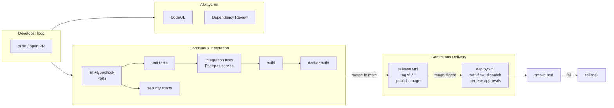

# CI_CD.md — Continuous Integration & Continuous Delivery Design

> Authoritative design document for WanderSync's CI/CD pipeline.
> The actual workflows live in [`.github/workflows/`](./.github/workflows/).
> See [`AGENTS.md` §7](./AGENTS.md#7-cicd) for the contributor TL;DR and
> [`Architecture.md` §5.6](./Architecture.md#56-cicd) for stack-level context.

---

## Table of Contents

1. [Pipeline Philosophy](#1-pipeline-philosophy)
2. [At a Glance](#2-at-a-glance)
3. [Stage-by-Stage Reference](#3-stage-by-stage-reference)
4. [SDLC Mapping](#4-sdlc-mapping)
5. [DevOps Practices Applied](#5-devops-practices-applied)
6. [Security Posture](#6-security-posture)
7. [Trade-offs Accepted](#7-trade-offs-accepted)
8. [Implemented Now vs Roadmap](#8-implemented-now-vs-roadmap)
9. [Operations Runbook](#9-operations-runbook)
10. [Glossary](#10-glossary)

---

## 1. Pipeline Philosophy

Five principles drive every choice in this pipeline:

1. **Shift left, fail fast.** The cheapest bug to fix is the one a developer sees within 60 s of pushing. Lint and typecheck run before tests; tests run before builds; builds run before scans.
2. **Reproducibility over speed.** Every artifact is traceable to a commit SHA. We never re-tag images. Floating environment tags (`:staging`, `:production`) are *pointers*, not new builds.
3. **Least privilege everywhere.** Workflow-level `permissions: contents: read`. Jobs request more only when they need it. No long-lived cloud credentials — OIDC when wired.
4. **Trunk-based development.** Short-lived branches → PR → merge to `main` → continuously deployable. No release branches, no merge queues until volume justifies them.
5. **Honest about scope.** Where a stage is a stub (deploy, smoke test) we say so loudly and link to the next step. Documentation never claims more than the pipeline delivers.

---

## 2. At a Glance

### Workflow inventory

| File | Trigger | Purpose | Blocking? |
|---|---|---|---|
| `.github/workflows/backend-ci.yml` | `push` to main + `pull_request` (path-filtered to `backend/**`) | Backend lint → unit → integration → build → docker → security | Required for merge |
| `.github/workflows/frontend-ci.yml` | `push` to main + `pull_request` (path-filtered to `frontend/**`) | Frontend lint → unit → build → docker → security | Required for merge |
| `.github/workflows/codeql.yml` | PR + `push` to main + weekly cron | JS/TS SAST via CodeQL `security-extended` queries | Required (PR), informational (cron) |
| `.github/workflows/dependency-review.yml` | PR | Diff-only check for new HIGH/CRITICAL CVEs and disallowed licenses | Required for merge |
| `.github/workflows/release.yml` | Tag push `v*.*.*` (after verifying the tag is on `main`) | Publish immutable images to GHCR | n/a (tag-only) |
| `.github/workflows/deploy.yml` | `workflow_dispatch` (manual, environment-protected) | Deploy a chosen image to a chosen environment with smoke test + rollback hook | Manual approval required for `production` |

---

## 3. Stage-by-Stage Reference

Each row below is one *stage* (a job or logical group of jobs).

| # | Stage | Workflow(s) | Inputs | Outputs | Gate (if failing) |
|---|---|---|---|---|---|
| 1 | **lint-and-typecheck** | both -ci | Source code | Pass/Fail | Blocks all downstream jobs in same workflow |
| 2 | **unit-tests** | both -ci | Source code, mocked deps | Coverage artifact (`*-unit-coverage`) | Blocks build & integration |
| 3 | **integration-tests** (backend only) | backend-ci | Source code + Postgres service container + Prisma schema | Pass/Fail | Blocks build |
| 4 | **build** | both -ci | Source code | Build artifact (`backend-dist`, `frontend-next`) | Blocks docker-build |
| 5 | **docker-build** | both -ci | Build artifact + Dockerfile | OCI image (kept locally on PR; no push) | Blocks PR merge |
| 6 | **security** | both -ci | Source code, lockfile | SARIF uploaded to *Security → Code scanning*; npm audit | Advisory on PR; blocking on `main` |
| 7 | **CodeQL SAST** | codeql | Whole repo | SARIF in code scanning | Blocking on PR (per branch protection) |
| 8 | **dependency-review** | dependency-review | PR diff | Sticky PR comment if violations | Blocks PR merge on HIGH/CRITICAL |
| 9 | **release** | release | `v*.*.*` tag on a commit on `main` | Pushed images: `:<semver>` + `:<sha>`; image digest in job output | If release fails, no images published; tag remains in repo |
| 10 | **deploy** | deploy | Selected env + service | Updated platform deployment | Manual; protection rule requires reviewer for `production` |
| 11 | **smoke test** | deploy | Deployed environment URL | Pass/Fail (curl health endpoint) | Triggers rollback note on failure |

### Why the job split (vs one monolithic job)

The previous CI ran *everything* in a single job called "Lint • Typecheck • Test • Build". That meant:
- A simple lint error wasted ~3 min waiting for npm install + prisma generate + tests.
- Coverage from unit tests was conflated with integration tests.
- Postgres was provisioned even when no integration tests were touched.

Splitting into 6 jobs lets:
- **Lint+typecheck** finish in ~45 s (visible on the PR check before unit tests even start).
- **Unit** and **security** fan out in parallel after lint, halving total wall-clock for typical PRs.
- **Integration** isolate the (slower) DB cost so we can later tune it independently (e.g. matrix across PG versions).
- **Coverage artifacts** stay separable for accurate per-suite reporting.

### Caching strategy

| Layer | Mechanism | Cache key |
|---|---|---|
| npm | `actions/setup-node@v4` with `cache: 'npm'` | hash of `package-lock.json` |
| Next.js incremental build | `actions/cache@v4` over `frontend/.next/cache` | OS + lockfile hash + source files hash |
| Docker layers | `docker/build-push-action@v6` with `cache-from/to: type=gha,mode=max` | layer digests |
| Prisma client | regenerated each job (cheap, deterministic — no caching needed) | n/a |

GHA cache is shared across all workflows in the repo (10 GB pool, LRU). Per [GitHub docs](https://docs.github.com/actions/using-workflows/caching-dependencies-to-speed-up-workflows), least-recently-used caches are evicted automatically when the pool fills.

### Concurrency

Every CI workflow uses `concurrency: { group: <name>-${{ github.ref }}, cancel-in-progress: true }`: when a developer pushes a new commit to a PR branch, the in-flight run is cancelled. This prevents two builds racing for cache slots and saves runner minutes.

`deploy.yml` and `release.yml` use `cancel-in-progress: false` — once a release is publishing, we let it finish.

---

## 4. SDLC Mapping

| SDLC Phase | What it means here | Where in our pipeline | Tools / Practices |
|---|---|---|---|
| **Plan** | Define the change in a spec/issue | `PRODUCT_SPEC.md`, `change_log/` rules in `AGENTS.md`, GitHub Issues | spec-first, issue templates |
| **Code** | Write code locally | local + AI agent loop (see `AGENTS.md`) | TS strict mode, Zod, Prisma |
| **Build** | Produce reproducible artifacts | `backend-ci.yml#build`, `frontend-ci.yml#build`, Docker images via `release.yml` | tsc, next build, multi-stage Dockerfile |
| **Test** | Prove the build works | unit-tests, integration-tests, codeql, security | Jest, Supertest, RTL, CodeQL, Trivy |
| **Release** | Cut a versioned, immutable artifact | `release.yml` on tag push | SemVer tags, GHCR images, digest output |
| **Deploy** | Roll the release into an environment | `deploy.yml` (manual, env-protected) | OIDC (planned), platform-native rolling/blue-green |
| **Operate** | Keep the system running | post-deploy smoke test + (planned) health probes | curl smoke, alerts (roadmap) |
| **Monitor** | Detect problems & feed back | (roadmap) Sentry + log aggregation + DORA metrics | Sentry, OpenTelemetry, GitHub deployment timeline |

The DORA "four key metrics" (Deployment Frequency, Lead Time for Changes, Change Failure Rate, Mean Time to Recovery) become directly measurable from this pipeline once `deploy.yml` is wired:
- **Deployment Frequency** = count of successful `deploy.yml` runs per week.
- **Lead Time for Changes** = `deploy.yml.run_at - commit.committed_at`.
- **Change Failure Rate** = `failed_deploys / total_deploys`.
- **MTTR** = time from a failed `deploy.yml` to the next successful one for the same service.

---

## 5. DevOps Practices Applied

| Practice | How we apply it |
|---|---|
| **Trunk-based development** | One long-lived branch (`main`); short-lived PRs; required green CI for merge. |
| **Continuous Integration** | Every PR triggers the full CI matrix; no batching; merges require all checks green. |
| **Continuous Delivery** | Every merge produces buildable artifacts; tags produce immutable images; deploy is one click. |
| **Shift-left testing** | Lint, typecheck, unit tests, SAST run on PR — *before* the code reaches main. |
| **Shift-left security** | CodeQL, Dependency Review, npm audit, Trivy run on PR. |
| **Immutable infrastructure** | Images tagged by SHA; never overwritten. Re-deploys re-pull the same digest. |
| **Infrastructure as Code (partial)** | Workflows in YAML (versioned with code). The deploy target itself is not yet IaC; documented as roadmap. |
| **Least privilege** | Workflow-level `permissions: contents: read`; per-job escalation. |
| **Fast feedback** | Job split puts lint failures on the PR in <60 s. |
| **Automated dependency updates** | (Roadmap) Dependabot for npm + GitHub Actions. |
| **Observability** | (Roadmap) Sentry for runtime, GitHub Actions for build observability via the timeline UI. |
| **Reversibility** | Documented rollback path in `deploy.yml`; image digest captured in `release.yml`. |

---

## 6. Security Posture

### Layered defenses

| Layer | Tool | What it catches | When it runs |
|---|---|---|---|
| **Source** (SAST) | CodeQL `security-extended` | Injection, prototype pollution, unsafe deserialization, taint flows | PR + push to main + weekly cron |
| **Source diff (SCA)** | `actions/dependency-review-action@v4` | New CVEs introduced by the PR; disallowed licenses | PR only |
| **Lockfile (SCA)** | `npm audit --audit-level=high` | All known advisories in installed deps | every CI job |
| **Filesystem (SCA)** | `aquasecurity/trivy-action` | OS-level + language-level CVEs in repo | every CI job |
| **Container (planned)** | Trivy on built image | CVEs in base image + final layers | post-build (roadmap — currently fs-only) |
| **Supply chain (planned)** | sigstore/cosign image signing + SLSA L3 provenance | Verifies origin and build integrity | release-time (roadmap) |

### Fail policy

| Surface | PR (developer is iterating) | `main` push / release |
|---|---|---|
| `npm audit --audit-level=high` | warn (non-blocking) | **block** |
| Trivy CRITICAL/HIGH | warn + SARIF upload | **block** |
| CodeQL | block | block |
| Dependency Review | block | n/a |

The PR/main split prevents a newly-disclosed CVE in a transitive dep from blocking unrelated PRs at midnight, while still keeping `main` clean.

### Secrets

- **GITHUB_TOKEN** is workflow-scoped to `contents: read` by default; jobs that need more (e.g. `packages: write` for GHCR push) escalate explicitly.
- **No long-lived cloud credentials.** When `deploy.yml` is wired, it MUST use **OIDC federation** to AWS / GCP / Azure (per [GitHub OIDC docs](https://docs.github.com/actions/deployment/security-hardening-your-deployments/about-security-hardening-with-openid-connect)). Static keys are forbidden by policy.
- **Environment secrets** (per *Settings → Environments*) gate deploys: production requires a named reviewer to approve before any `deploy.yml` step that uses `environment: production` runs.

### Action pinning policy

We pin GitHub Actions to **major version tags** (`@v4`) for ergonomics. This trades the convenience of getting bug fixes for free against the risk of a malicious tag move (as happened with `tj-actions/changed-files` in March 2025). Hardened repositories should pin to **commit SHAs** and pair with **Dependabot** for automated updates. Documented as a roadmap item; not blocking for our project size.

---

## 7. Trade-offs Accepted

| Decision | We chose | We deferred | Why |
|---|---|---|---|
| **Test runner** | Jest | Vitest | Already documented in `Architecture.md §5.5`; consistent across stacks. |
| **Integration DB strategy** | Service container + `prisma migrate reset` per job | Testcontainers | Service containers are simpler in GHA; Testcontainers shines locally and in self-hosted runners. |
| **Pinning** | Major-tag (`@v4`) | SHA pinning + Dependabot | Project size; revisit after first prod incident or quarterly. |
| **SAST tool** | CodeQL | Semgrep | Native to GitHub; zero-config for JS/TS. |
| **Container scan** | Trivy filesystem | Trivy on built image + Grype | One scanner now; expand once we publish images for real. |
| **Deploy strategy** | Manual `workflow_dispatch` with env protection | Auto-promote on green main | Avoids surprise deploys before we have proper canary/observability. |
| **Image signing** | Defer | Cosign + SLSA L3 attestation | High effort, low marginal value at our threat level today. |
| **Release process** | Manual `git tag` | semantic-release / changesets | Keep humans in the loop; revisit when release cadence > weekly. |
| **E2E tests** | Defer | Playwright in `frontend-ci` | High value but expensive setup; documented in `Architecture.md`. |
| **Monorepo tooling** | npm workspaces (implicit via paths filter) | Turborepo / Nx | Two packages don't justify a monorepo orchestrator. |

---

## 8. Implemented Now vs Roadmap

### Implemented (this PR)

- ✅ Job-split CI for backend (6 stages) and frontend (5 stages)
- ✅ Postgres service container with deterministic reset for integration tests
- ✅ CodeQL `security-extended` on PR + weekly
- ✅ Dependency Review action with HIGH/CRITICAL block + license deny-list
- ✅ Trivy filesystem scan with PR-warn / main-block fail policy
- ✅ npm audit with same fail policy
- ✅ SARIF uploads to GitHub Security → Code scanning
- ✅ Tag-driven `release.yml` with on-main verification, immutable tags, digest output
- ✅ Per-environment protected deploy with smoke-test + rollback note steps
- ✅ Path filtering, concurrency cancellation, npm cache, Docker layer cache, Next.js build cache

### Roadmap (call out in PR descriptions before adopting)

- **OIDC** federation to a chosen cloud (AWS/GCP/Azure/Fly.io) — replaces all long-lived credentials.
- **Cosign** image signing + **SLSA L3 provenance** attestations on `release.yml`.
- **Dependabot** for both `npm` and `github-actions` ecosystems; pair with **SHA pinning**.
- **Playwright e2e** stage gated behind `[e2e]` label or scheduled.
- **Container scan on built image** (Trivy on `wandersync-{backend,frontend}:ci`) in `docker-build`.
- **Build provenance**: `actions/attest-build-provenance@v1` on `release.yml`.
- **DORA metrics export** (a small workflow that posts deploy events to a metrics store).
- **Sentry release marker** in `deploy.yml` (`sentry-cli releases new $VERSION`).
- **Auto-rollback** on failed smoke test (currently only a warning).

---

## 9. Operations Runbook

### "I want to ship a feature"
1. Open a PR. Backend-CI / Frontend-CI / CodeQL / Dependency Review will run automatically.
2. Get all required checks green and an approving review.
3. Squash-merge to `main`.
4. (No automatic deploy — see next.)

### "I want to release a version"
1. Pull latest `main`.
2. `git tag v1.2.3 && git push origin v1.2.3`.
3. `release.yml` runs, verifies the tag is on `main`, builds and pushes both images to GHCR.
4. Job output contains the image digest. Copy it for audit.

### "I want to deploy to staging / production"
1. *Actions → Deploy → Run workflow*.
2. Select `environment` and `service`. Production runs require named reviewer approval.
3. After deploy, the placeholder smoke test runs. If it fails, follow the rollback note.

### "Something is on fire"
- Check the GitHub Actions run logs (timeline UI).
- For runtime issues, check (roadmap) Sentry & log aggregator.
- To roll back: re-run `deploy.yml` with the previous successful image SHA, OR invoke the platform's native rollback (e.g. `flyctl releases rollback`).

### "A new CVE blocks main but not my PR"
- Expected behaviour (PR-warn / main-block).
- Open a follow-up PR that bumps the affected dep; both checks should go green.
- If no fix exists, document an exception in `change_log/` referencing the CVE and the mitigating control.

---

## 10. Glossary

- **SAST** — Static Application Security Testing. Analyses source code without running it.
- **SCA** — Software Composition Analysis. Inspects third-party dependencies.
- **OIDC** — OpenID Connect. Lets GitHub Actions exchange a short-lived JWT for cloud credentials (no static secrets).
- **SLSA** — Supply-chain Levels for Software Artifacts; framework for graded build integrity guarantees.
- **GHCR** — GitHub Container Registry (images live at `ghcr.io/<owner>/<repo>/...`).
- **SARIF** — Static Analysis Results Interchange Format; the JSON format GitHub's Code Scanning UI consumes.
- **DORA** — DevOps Research and Assessment; the four metrics (Deploy Frequency, Lead Time, Change Failure Rate, MTTR).
- **DORA** is also the standard reference for high-performing teams (https://dora.dev/).
- **Trunk-based development** — Single long-lived branch + short-lived feature branches.
